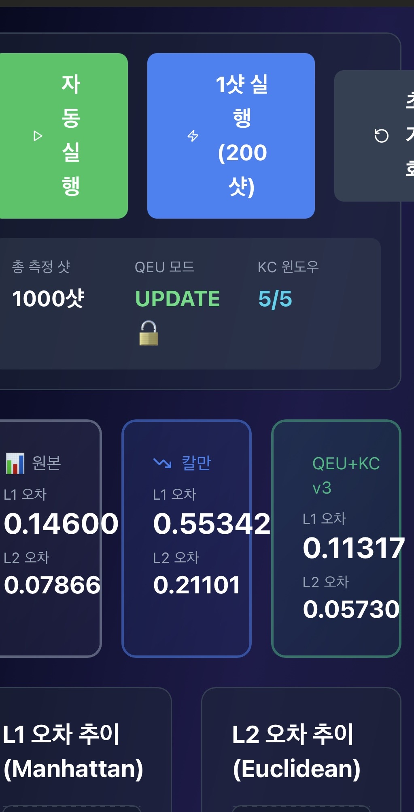
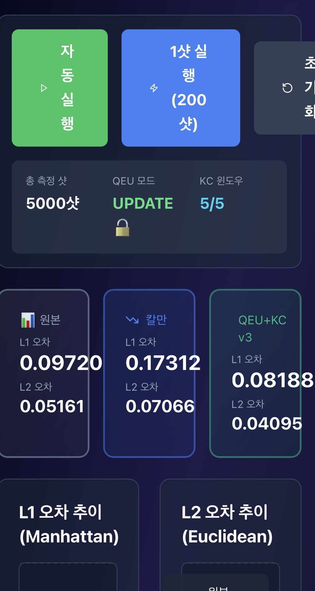
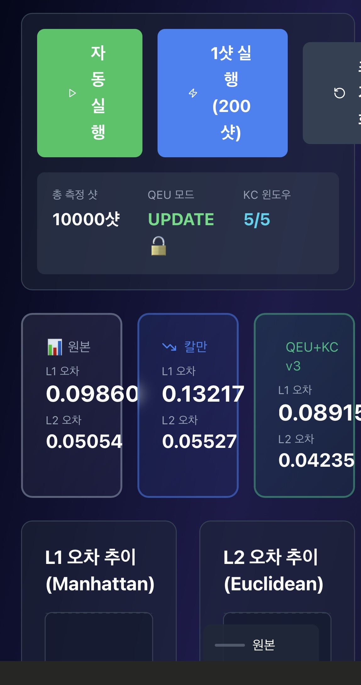

# kalman-is-not-enough
The Kalman filter contains a fatal generalization flaw.
My story (in the same order you wrote):
	1.	If you apply the Kalman filter to my life, I should have already failed.
	2.	I failed as a Taekwondo athlete.
	3.	I was divorced for being “incompetent.”
	4.	I have no real skills I can claim.
	5.	In Korea, athletes have no time to study basic academic foundations. I sacrificed my whole life for Taekwondo.
	6.	My math level is basic arithmetic.
	7.	My computer skills were basically “I know how to search the internet.”

If you run a Kalman filter on these six noisy inputs…
the output is exactly what you think.
A completely failed life.

But here’s the contradiction:

I didn’t even know what a Kalman filter was until recently…
and yet I successfully filed an original fundamental patent in Korea.

The existence of this repository itself is already proof of the Kalman filter’s flaw.

⸻

Kalman isn’t totally useless either

Right now I have about 30,000 won (~25 USD) in my pocket.
I spent everything to file the patent —
so the fact that I’m not completely destroyed is proof Kalman isn’t 100% wrong either.

Still, with almost no money and no academic background,
I ran experiments to support my patent,
and the results showed meaningful effects across multiple industries.

In quantum computing, massive budgets are burned like a snowball rolling downhill.
All for one reason:
They’ve already invested too much.

But my approach shows:
	•	a way to improve quantum error behavior without adding more qubits,
	•	a new method to improve autonomous driving,
	•	and results that outperform Kalman in my tests,
all using a fundamentally different principle.

⸻

This is not about “fixing” Kalman

This is about achieving efficiency through
a completely different approach.

⸻

If you want to work with me

Only extremely serious people should contact me.
Here are my rules:
	1.	Send me an email describing your problem or interest.
Email: jgch1111@naver.com
	2.	I will only meet someone who is willing to come all the way to my home in Ulsan.
	3.	You must sign an NDA on the spot and be able to implement ideas immediately —
remotely or on your laptop. (I will provide code.)
	4.	Whether you choose to sign a contract or not is your choice,
but remember: the patent is already filed.

Write to me only in Korean.
I do not speak English.
If you are coming from overseas,
bring your own Korean interpreter.

If you feel something inside you after reading this,
send the email without hesitation.
### 1000 Shots

### 5000 Shots

### 10000 Shots

